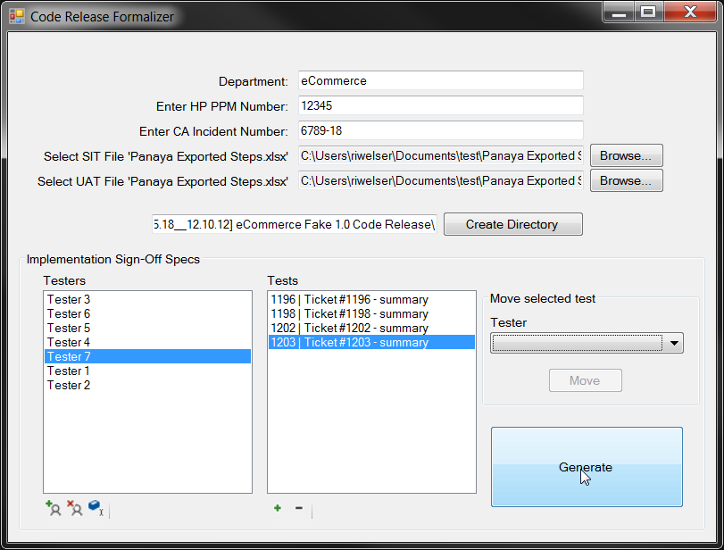

# code-release-formalizer

#### Winforms application for automatically generating approval documents for HP PPM/CA Service Desk

*Latest version: v1.0*

* ##### A winform application that pulls in tester info from a Panaya .xlsx export (supports files produced in Panaya via "Export > Steps")
    1. Specify your department, the CA Service Desk ticket number, and its associated HP PPM incident ticket number.
    2. Specify the SIT Panaya Export file and UAT Panaya Export file
        * These can be the same if no distinction is needed for evidence purposes or approval
    3. A directory name will be posed, and then to proceed, click "Create Directory".
        * This directory will be deleted if the field is modified and the button re-clicked to create a new directory
        * The directory will not be populated with files until the final "Generate" button is clicked
    4. Testers and Tests can be added, removed, and renamed
    5. Individual tests can be moved between the existing testers
