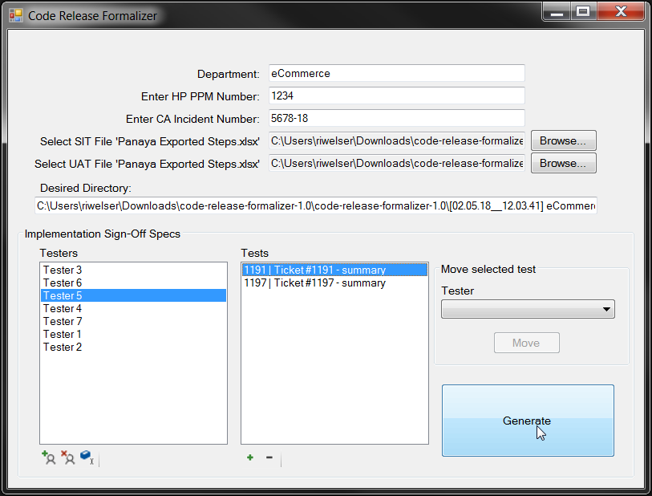

# code-release-formalizer

#### Winforms application for automatically generating approval documents for HP PPM/CA Service Desk

*Latest version: v1.1*

* ##### A winform application that pulls in tester info from a Panaya .xlsx export (supports files produced in Panaya via "Export > Steps")
    1. Specify your department, the CA Service Desk ticket number, and its associated HP PPM incident ticket number.
    2. Specify the SIT Panaya Export file and UAT Panaya Export file
        * These can be the same if no distinction is needed for evidence purposes or approval
    3. A directory name will be posed, and the testers & tests will be generated for review/modifications
        * Testers and Tests can be added, removed, and renamed
        * Individual tests can be moved between the existing testers
